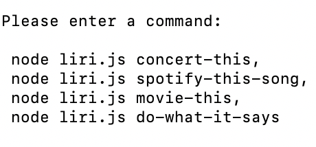
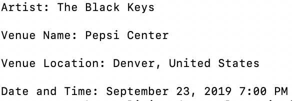
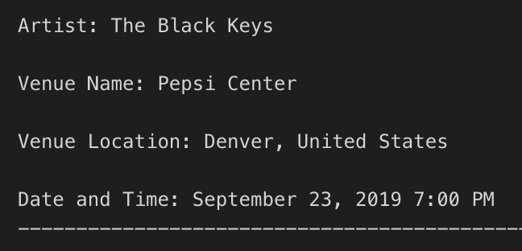
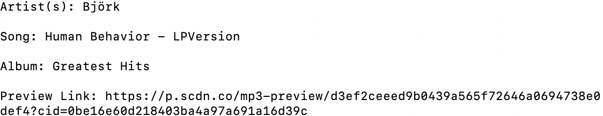
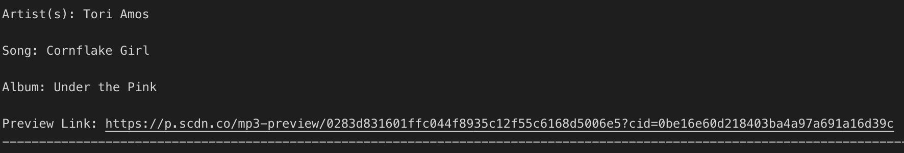
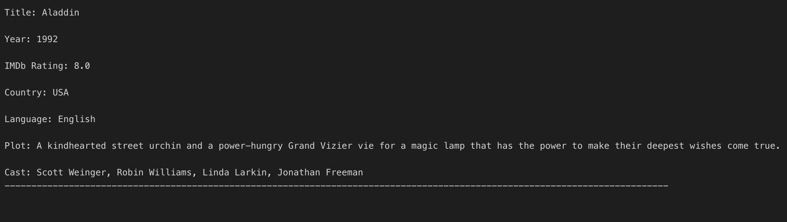

# liri-node-app

### About the App:

LIRI (Lanaguage Interpretations and Recognition Interface) is a command line node app that takes in user inputs given specific command and returns specific data back to the user.  The user has the options of using these four commands along with his/her own inputs:

 

### How to Use LIRI:

1. Open your terminal such as Bash.
2. Navigate to the liri-node-app folder that contains the liri.js file.
3. Type one of the four commands in your terminal. 
4. The system will display your results based on your command and specific input, and then updates the log.txt file with your latest results.

### concert-this 

Type in the command line: node liri.js concert-this The Black Keys

Then the results of your search appears in log.txt:

### spotify-this-song

Type in the command line: node liri.js spotify-this-song Cornflake Girl

Then the results of your search appears in log.txt:

### movie-this

Type in the command line: node liri.js movie-this Aladdin

Then the results of your search appears in log.txt:

### Thanks for visiting my github!
